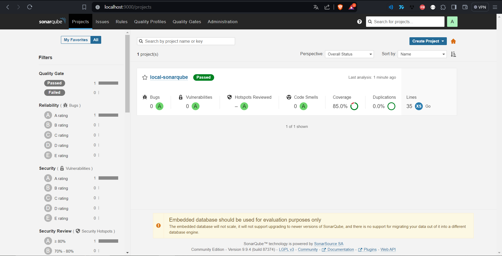

# Local-SonarQube
## Introduction
Local-SonarQube has been created to facilitate the setup of a local SonarQube server, allowing for easy scanning of your own code to identify vulnerabilities, bugs, code smells, etc. The following services will be created upon completion of the building process:
- SonarQube server --> localhost:9000
- Postgres DB

Additionally, a basic HTTP server was developed using Go, accompanied by its respective unit tests. When the server is up, it listens for requests on port 8080, extracting the 'param1' and 'param2' parameters from the GET request. If these parameters are numerical values, the server computes their sum and returns it. This server serves as a useful tool for checking coverage using the SonarQube scanner.
## Prerequisites
In order to be able to run this project correctly, you should have the following technologies installed on your computer:
- [Docker](https://www.docker.com/). You'll need Docker to build the dev container where the different services will be running.
- [VS Code Dev Containers extension](https://marketplace.visualstudio.com/items?itemName=ms-vscode-remote.remote-containers). This extension allows you build and run dev containers using Docker.
## Build and run project
To build this project, you can follow any of the following approaches:
- Simply, open this project with VS Code and it will detect a dev container configuration file showing a new notification, then, you can just click on "Reopen in Container".

- Also, you can open your VS Code command palette with the command "Ctrl + Shift + P" and search for "Reopen in Container" command from Dev Containers extension.

After the container build is completed, the 'init-sonar.sh' script is executed, generating the necessary configuration file from SonarQube and creating the project 'local-sonarqube' on the local SonarQube server using the default credentials. Once the script execution is finished, you can click on the 'Sonar' task to run the unit tests and execute the 'sonar-scanner' command.

Then, you can go to your http://localhost:9000, enter the default credentials "admin:admin" and check the result of the SonarQube scanner.

